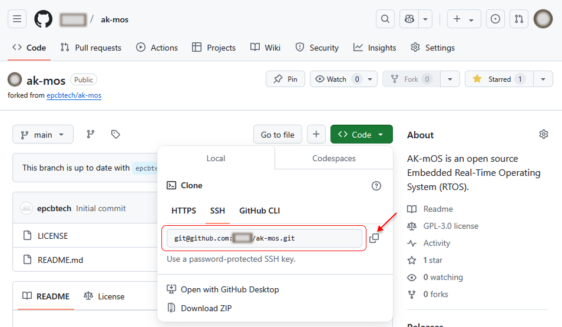

# Contribution Guide

We sincerely thank you for your contribution, and welcome to submit the code through GitHub's fork and Pull Request processes.

First, explain the word Pull Request. Pull request means to send a request. The purpose of the developer initiating Pull Request is to request the repository maintainer to adopt the code submitted by the developer.

When you want to correct mistakes in other people's repositories, follow the following procedure:

- To fork someone else's repository is equivalent to copying someone else's information. Because you can't guarantee that your modification is correct and beneficial to the project, you can't modify it directly in someone else's repository, but first fork it into your own git repository.
- Clone code to your own PC local, create a new branch, modify bugs or add new features, and then launch pull request to the original repository, so that the original repository manager can see the changes you submitted.
- The original repository manager reviews this submission and, if correct, merge it into his own project. Merge means merging, merging the part of code you modified into the original repository to add code or replace the original code. So far, the whole Pull Request process is over.

## Coding Style

Refer to the `coding_style_en.txt` file in the ak-mos project documentation directory for the AK-mOS code programming style.

## Preparation

Install Git: You need to add Git's directory to the system environment variable.

## Contribution Process

Now take AK-mOS repository as an example to illustrate the process of contributing code:

### Fork

Fork the epcbtech/ak-mos repository into your git repository.


### Clone

In your repository, copy the repository links after your fork:



You can use the `git clone` command to copy the repository to your PC:

```
git clone [url]
```

### Create a New Branch

It is recommended that you create your own development branch based on the master branch, and use following  commands to create a new branch:

```
git checkout -b YourBranchName
```

For example, create a branch named "dev": `git checkout -b dev`.

### Developing

Modify bugs and submit new functional code. For example, suppose the developer fix a RF driver bug:

### Temporarily Store Modified Files

Add all changes to the temporary area:

```
git add .
```

If you only want to add some specified files to the temporary area, use other commands of `git add`.

### Commit

Submit this modification to the local repository:

```
git commit -m "[TAG] Describe your submission here." \
           -m "- Detail a: Lorem ipsum dolor sit amet, consectetur adipiscing elit." \
           -m "- Detail b: Mauris vitae neque at tellus consectetur dignissim."
```

> Note: If there are multiple commits in the local development branch, in order to ensure that the AK-mOS repository commit is clean, please tidy up the local commits. More than five commits are not accepted by Pull Request.。

### Push to Your Remote Repository

Push the modified content to the branch of your remote repository. It is recommended that the branch name of the remote repository be consistent with the local branch name. Use the following command to push:

```
git push origin YourBranchName
```

### Create a Pull Request

Enter the AK-mOS repository under your Github account and click `New pull request -> Create pull request`. Make sure you choose the right branch.

Step 1: Fill in the title of this Pull Request

Step 2: Modify the description information of this Pull Request (modify it in `Write` and preview it with `Preview`).

Step 3：Create pull request.

### Review Pull Request

Once the request is successful, the AK-mOS maintainer can see the code you submitted. The code will be reviewed and comments will be filled in on GitHub. Please check the PR status in time and update the code according to the comments.

### Merge Pull Request

If the Pull Request code is okay, the code will be merged into the AK-mOS repository. This time Pull Request succeeded.

So far, we have completed a code contribution process.

## Keep in Sync with AK-mOS Repository

The content of the AK-mOS GitHub repository is always updated. To develop based on the latest AK-mOS code, you need to update the local repository.

After clone, the local master branch content is consistent with the master branch content of the AK-mOS repository. But when the AK-mOS repository is updated, your local code is different from the AK-mOS code.

The local master is synchronized with the AK-mOS repository of your own GitHub account. If there is no content modification for the master branch (please create a new branch for development), then you can keep the local code synchronized with the AK-mOS repository according to the following steps:

- To view the existing remote repository, there is usually only one default origin, which is your own remote repository:

```c
$ git remote -v
origin  https://github.com/YOUR_USERNAME/YOUR_FORK.git (fetch)
origin  https://github.com/YOUR_USERNAME/YOUR_FORK.git (push)
```

* Add the AK-mOS remote repository and name it `akmos`,  or you can customize the name by yourself:

```c
$ git remote add akmos https://github.com/epcbtech/ak-mos.git
```

* View all remote repositories tracked locally:

```c
$ git remote -v
origin      https://github.com/YOUR_USERNAME/YOUR_FORK.git (fetch)
origin      https://github.com/YOUR_USERNAME/YOUR_FORK.git (push)
akmos       https://github.com/epcbtech/ak-mos.git (fetch)
akmos       https://github.com/epcbtech/ak-mos.git (push)
```

* Pull the code from the master branch of AK-mOS remote repository and merge it into the local master branch:

```c
git pull akmos master
```
